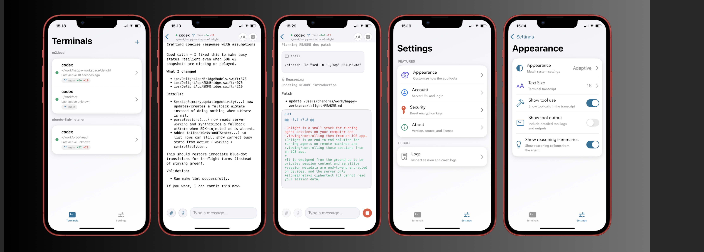

# Delight

[](https://github.com/bhandras/delight/actions/workflows/go-tests.yml)
[](https://github.com/bhandras/delight/actions/workflows/go-lint.yml)
[](https://github.com/bhandras/delight/actions/workflows/ios-tests.yml)
[](LICENSE)

Delight is an end-to-end solution for running agents on remote machines and
viewing/controlling those sessions from an iOS app.

It is designed from the ground up to be private: session content and sensitive
session metadata are end-to-end encrypted on devices, and the server only
stores/relays ciphertext (it cannot read your session data).

Delight is experimental and intended primarily for personal use.

<p align="center">
  
</p>

At a high level:

- The **CLI** runs an agent backend (Codex, Claude, etc) in a local terminal
  directory and streams encrypted events.
- The **server** stores metadata, fans out updates over WebSockets, and
  coordinates pairing/authentication (it cannot read end-to-end encrypted
  message content).
- The **iOS app** pairs to a terminal, shows the transcript, and can request
  remote control depending on the agent + permission mode.

This repo contains all three pieces, plus shared protocol/logger libraries.

## Project Goals

- **Go end-to-end**: keep as much of the stack as possible in Go (CLI, server,
  SDK bindings) for a small, auditable surface area.
- **Mobile remote control**: pair a terminal session to a phone UI with a tight
  focus on session visibility and operator control.
- **AI-engineered**: this project is built end-to-end with AI agents (the goal
  is to stay fast and iterative, not to be a polished product).

## Components

- `cli/README.md` - CLI usage, commands, development
- `server/README.md` - Server configuration, local run, public hosting
- `ios/README.md` - iOS app build + simulator workflow
- `docs/PUSH_NOTIFICATIONS.md` - Encrypted APNs/gorush architecture + setup
- `docs/BUILD_AND_RELEASE.md` - Build targets, signing, TestFlight upload
- `docs/PROTOCOL_ENCRYPTION.md` - Protocol-level E2E encryption details

## Quick Start (Local Dev)

1) Start the server:

```bash
cd server
make secret
cat > .env <<EOF
PORT=3005
DELIGHT_MASTER_SECRET=<paste-secret-from-make-secret>
DATABASE_PATH=./delight.db
DEBUG=true
EOF
make run
```

2) Authenticate the CLI once and start a session:

```bash
cd cli
make build
./delight auth --server-url=http://localhost:3005
./delight run --server-url=http://localhost:3005
```

3) Build and run the iOS app in the simulator:

```bash
make ios-run
```

## Notifications (Pushover)

Delight can send Pushover notifications when a turn finishes or when the app
needs attention (e.g. permission prompts). Notifications are emitted by the
**CLI**, not the server, so nothing is revealed to the server: the CLI has the
local context (agent, machine, directory) and the server remains blind to
end-to-end encrypted payloads.

Enable Pushover by setting these environment variables:

```bash
export DELIGHT_PUSHOVER_TOKEN=your_app_token
export DELIGHT_PUSHOVER_USER_KEY=your_user_key
```

Optional settings:

```bash
# Comma-separated list: turn-complete, attention
export DELIGHT_PUSHOVER_EVENTS=turn-complete,attention

# Cooldown in seconds (per alert type)
export DELIGHT_PUSHOVER_COOLDOWN_SEC=60

# Pushover priority (-2..2)
export DELIGHT_PUSHOVER_PRIORITY=0
```

You can also control notifications with a CLI flag:

```bash
./delight run --pushover=auto   # default: only when creds are set
./delight run --pushover=on     # force enable (requires creds)
./delight run --pushover=off    # disable
```

## Encrypted Mobile Push (APNs via gorush)

Delight also supports encrypted push notifications delivered to the iOS app:

- The **CLI** encrypts notification metadata (label/agent/host/path/event).
- The **server** stores device tokens and forwards ciphertext to a local
  `gorush` sidecar.
- The **iOS app** decrypts payloads locally with the master key.

This keeps push content unreadable to both the server and the push gateway.

Configure the server deployment with:

- `DELIGHT_PUSH_BACKEND=gorush`
- `DELIGHT_GORUSH_URL=http://gorush:8088/api/push`
- `DELIGHT_PUSH_TOPIC=<your ios bundle id>`

For complete setup and troubleshooting, see `docs/PUSH_NOTIFICATIONS.md`.

## Build And Release

The root `Makefile` includes local build/test targets and a full iOS release
pipeline (`ios-signing-resolve` → `ios-release-archive` → `ios-export-ipa` →
`ios-testflight-upload`).

For required env vars and TestFlight upload examples, see
`docs/BUILD_AND_RELEASE.md`.

## Public Hosting (HTTPS)

For public hosting, use the included Caddy + Docker Compose deployment. Caddy
automatically provisions and renews Let's Encrypt certificates.

```bash
./deploy/delight-server.sh init
${EDITOR:-vi} ./deploy-data/.env
./deploy/delight-server.sh up
```

See `server/README.md` for details and troubleshooting.

## Origins

This project is inspired by (and was originally prototyped by analyzing) the
Happy ecosystem:

- https://github.com/slopus/happy
- https://github.com/slopus/happy-cli
- https://github.com/slopus/happy-server

Delight is **not compatible** with Happy. The protocol and implementation here
are private-to-this-repo and may change freely.

The name "Delight" is a deliberate, fun reference to "Happy".

## License

MIT. See `LICENSE`.
